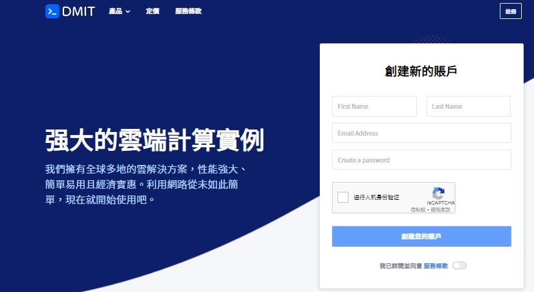
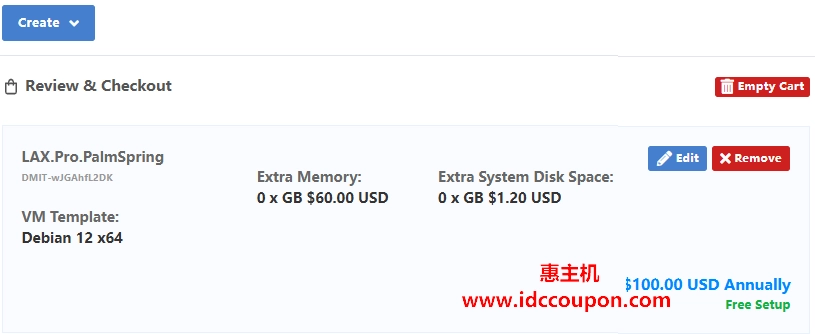

# DMIT Los Angeles LAX.Pro Series: CN2 GIA Premium VPS Starting at $100/Year

---

Recently, DMIT restocked two of their most sought-after Los Angeles VPS packages: LAX.Pro.Irvine and LAX.Pro.PalmSpring. Both offerings feature CN2 GIA routes with optimized network paths for mainland China access. If you're looking for reliable, high-speed connectivity to Asia at competitive rates, these limited-stock plans deliver solid performance without breaking the bank—starting at just $100 annually.

---

## Why These Plans Keep Selling Out

DMIT's LAX.Pro series was specifically designed to compete with similar premium CN2 GIA offerings in the market, but with better value propositions. The LAX.Pro.Irvine and LAX.Pro.PalmSpring packages consistently sell out within hours of restocking, primarily because they offer enterprise-grade routing at budget-friendly prices.

What makes these plans special? The network architecture. DMIT's PRO series uses bandwidth-optimized routes to mainland China:

- **China Telecom**: Outbound via CN2/CTG, return via CN2
- **China Mobile**: Outbound via CMIN2, return via CN2  
- **China Unicom**: Outbound via CUG VIP, return via CN2

All three major carriers' return traffic goes through the premium CN2 network, which means lower latency and more stable connections compared to standard routes. Each VPS includes 1 IPv4 and 1 IPv6 /64 subnet by default.

There's also a 10% discount code currently available, making these already-competitive prices even more attractive. But here's the catch—these are limited-quantity releases, not regular inventory. When they're gone, you'll need to wait for the next restock.

## LAX.Pro Special Edition Pricing

If you're curious about what a premium CN2 GIA connection can do for your Asia-Pacific traffic, 👉 [check out DMIT's LAX.Pro series performance benchmarks and real-world latency tests](https://www.dmit.io/aff.php?aff=13832). The difference in routing quality becomes obvious when you compare traceroutes side-by-side with regular providers.

## Alternative Options When Special Editions Sell Out

Can't grab a special edition package? DMIT's regular Premium series VPS plans offer identical hardware specs and the same three-network CN2 return routing. The main difference is pricing—these standard plans cost slightly more but maintain consistent availability. They're worth considering if you miss the limited-time restocks but still want that premium network performance.

These regular Premium plans include:
- Same CN2 GIA routing architecture
- 1 IPv4 and 1 IPv6 /64 subnet
- Identical datacenter locations (Irvine/PalmSpring)
- Standard DMIT support and SLA

## What You Should Know About DMIT's Refund Policy

Before purchasing, understand DMIT's refund structure:

**Full Refunds** (minus payment gateway fees):
- Service purchased within 3 days
- Transfer usage under 30GB

**Partial Refunds** (minus payment gateway fees):
- Service period not exceeding 30 days
- Calculated based on remaining transfer allowance or service time, whichever is lower

**No Refunds** in these situations:
- More than 3 refunds on same product series (per individual)
- (D)DoS-related activities
- Complaints about network quality after extended use
- IP geolocation issues
- Any TOS violations or abuse
- Transfer usage exceeding 3GB when IP is regionally unavailable
- Disputes filed directly with payment companies

If you encounter IP accessibility issues, contact DMIT support immediately—preferably on the same day of purchase.

## Is DMIT Right for Your Project?

The LAX.Pro series makes most sense if you're running services that need fast, stable connectivity to mainland China. Common use cases include:

- Content delivery to Asian markets
- E-commerce platforms serving Chinese customers  
- Gaming servers requiring low latency
- Websites targeting Chinese-speaking audiences
- API services with Asia-Pacific endpoints

The hardware configurations are solid across the board, but the real advantage is the network routing. CN2 GIA lines consistently outperform standard routes in terms of packet loss, latency stability, and peak-hour performance. For business-critical applications where every millisecond counts, that reliability matters.

That said, these special edition packages are legitimately limited. DMIT doesn't keep them permanently in stock—they release batches periodically. If you see them available and the specs match your needs, don't overthink it. The next restock might be weeks away.

---

## Final Thoughts

DMIT's LAX.Pro.PalmSpring and LAX.Pro.Irvine packages deliver genuine value for Asia-focused hosting needs. The CN2 GIA routing across all three major Chinese carriers ensures consistent performance, and the $100/year entry point makes premium connectivity accessible even for smaller projects. While these limited editions require quick action when available, the regular Premium series provides a reliable backup option with the same technical advantages. For projects requiring optimized China connectivity, 👉 [explore DMIT's full LAX.Pro lineup and current availability](https://www.dmit.io/aff.php?aff=13832) to find the right balance of performance and budget for your specific requirements.
